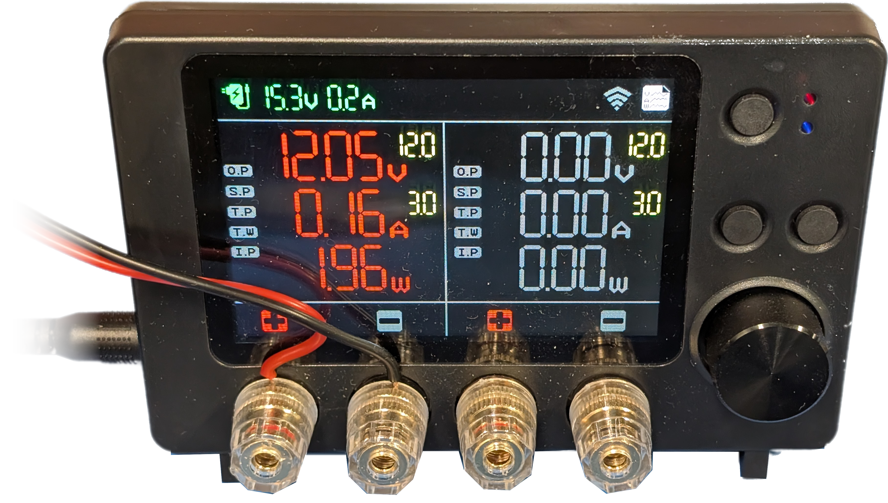

# Odroid Smart Power 3 Exporter

A Prometheus exporter for the **Odroid Smart Power 3**, written in Go. This exporter reads real-time power metrics from the OSP3 via a USB serial connection and exposes them for Prometheus scraping.

## Features

- **Real-time Monitoring**: Tracks voltage, current, power, and channel status.
- **Multi-Channel Support**: Reports metrics for `input`, `channel 0`, and `channel 1`.
- **Flexible Configuration**: Use command-line flags or environment variables.
- **Docker Ready**: Includes a multi-arch Dockerfile for easy deployment.
- **Auto-Reconnect**: Automatically attempts to reconnect if the serial connection is lost.

## Metrics

The exporter provides the following metrics on port `9120` (default) at `/metrics`:

| Metric Name          | Labels    | Description                          |
| -------------------- | --------- | ------------------------------------ |
| `osp3_voltage_volts` | `channel` | Voltage in Volts                     |
| `osp3_current_amps`  | `channel` | Current in Amperes                   |
| `osp3_power_watts`   | `channel` | Power in Watts                       |
| `osp3_status`        | `channel` | Channel status (1 for ON, 0 for OFF) |

_Note: Labels for `channel` are `input`, `0`, and `1`._

## Configuration

| Flag      | Environment Variable | Default        | Description                      |
| --------- | -------------------- | -------------- | -------------------------------- |
| `-device` | `DEVICE`             | `/dev/ttyUSB0` | Serial device path               |
| `-baud`   | `BAUD`               | `115200`       | Serial baud rate                 |
| `-port`   | `PORT`               | `9120`         | HTTP port for Prometheus metrics |
